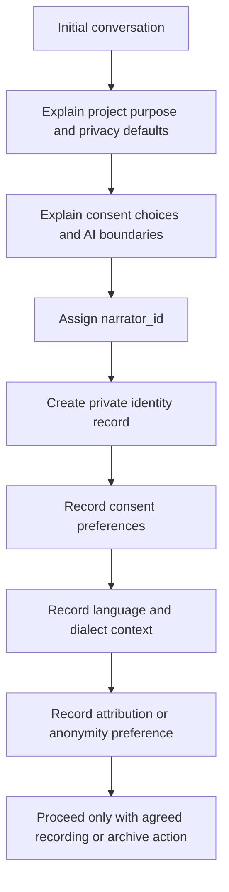

# QashqAI Voice Narrator Onboarding

## Purpose

This document defines a lightweight onboarding workflow for fictional or real future narrators. It is intended to support clear consent, narrator agency, privacy, cultural validation, and multilingual preservation.

## New Narrator Onboarding Workflow

## What To Explain

- The project is local-first and private by default.
- Narrator voice and stories are not public by default.
- Consent is specific and revocable.
- Transcription, translation, AI processing, AI training, embeddings, synthetic voice, research use, institutional sharing, public release, and commercial use are separate choices.
- Cultural validation may restrict publication or sharing.
- Identity can be separated from archive metadata.
- Future institutional sharing requires additional review.

## Minimum Onboarding Records

- `narrator_id`
- preferred display mode
- contact method, if appropriate
- family or community context, if the narrator chooses to provide it
- language and dialect notes
- attribution or anonymity preference
- initial consent record
- limitations or topics the narrator does not want recorded or shared

## Privacy Notes

Private identity records should not be stored in public metadata. Use narrator IDs in metadata and keep identity details in protected local storage.

## Human Review Required

Human care is required to ensure the narrator understands choices, does not feel pressured, can ask questions, and can revise consent later.

