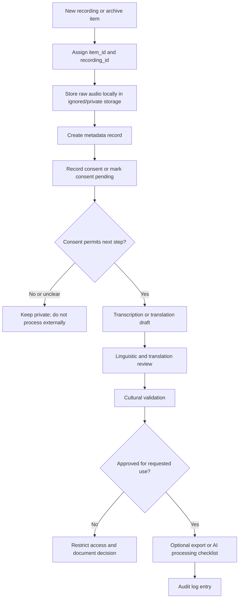

# QashqAI Voice Operational Workflow

## Purpose

This document translates QashqAI Voice governance policies into a lightweight operating workflow for a small team preparing for future institutional collaboration.

It does not replace the privacy, AI-use, access-control, or cultural validation policies. It defines the practical steps that should happen before material is processed, reviewed, exported, or shared.

## Operational Gaps Between Policy and Enforcement

Current gaps:

- policies exist, but there is no automated access-control system;
- consent fields exist, but processing is not blocked automatically when consent is missing;
- validation templates exist, but review is not enforced by software;
- exports can be created manually without a technical gate;
- revocation records can be written, but downstream removal is not automated;
- raw audio is protected by `.gitignore`, but local copies still depend on careful handling;
- identity separation exists structurally, but there is no encrypted identity registry yet;
- audit logs exist as templates, but entries are not generated automatically.

Until tooling exists, the project depends on disciplined checklist use and human review.

## Mandatory Human Review Points

Human review is mandatory before:

- accepting consent as valid for a specific use;
- interpreting dialect, idiom, or culturally specific meaning;
- approving translation for external use;
- changing access level beyond private or family-only;
- sharing with an institution;
- creating a dataset;
- using material for embeddings, AI training, or synthetic voice;
- publishing excerpts, summaries, transcripts, translations, or metadata;
- resolving reviewer disagreement;
- acting on revocation or emergency removal.

AI tools may assist with drafts, but they must not make final governance decisions.

## Where Automation Can Safely Help

Automation can help with:

- checking whether required metadata fields are present;
- matching `item_id`, `recording_id`, `consent_id`, and `validation_id`;
- warning when consent is missing, revoked, or ambiguous;
- warning when validation status is pending or restricted;
- detecting raw audio in trackable paths;
- generating checksums for local files;
- creating audit-log drafts;
- creating export manifests;
- checking whether AI permissions allow a requested operation;
- producing a list of items affected by revocation;
- validating CSV and JSON formats.

Automation should assist governance work, not replace consent, cultural review, or narrator agency.

## Risks That Cannot Be Automated Away

Some risks require human judgment:

- whether a narrator fully understands a proposed use;
- whether translation changes cultural meaning;
- whether dialect features are being erased or misclassified;
- whether oral-history context is too sensitive for sharing;
- whether institutional terms are acceptable;
- whether a reviewer has enough context or authority;
- whether public access could harm dignity, relationships, or trust;
- whether an apparently harmless excerpt becomes sensitive in another language or context.

## Lightweight Small-Team Workflow

## Routine Operating Steps

1. Assign stable IDs before processing.
2. Store raw audio only in ignored/private storage.
3. Create metadata with narrator ID, not legal identity.
4. Record consent in the ledger.
5. Keep consent pending if permission is incomplete.
6. Create transcript and translation drafts only when allowed.
7. Complete linguistic, translation, and cultural validation.
8. Log governance decisions in the audit log.
9. Use export or AI checklists before material leaves local custody or enters AI processing.
10. Treat revocation as a priority action.

## Future Automation Notes

Highest-value automation:

- metadata and consent schema validation;
- consent and validation gate before export;
- AI-permission gate before processing;
- raw-audio leak detection;
- audit-log generation;
- revocation impact report;
- export manifest generator.

