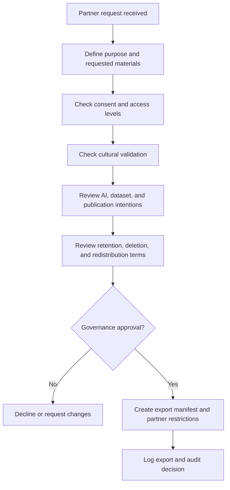

# QashqAI Voice Partnership Review

## Purpose

This document defines a lightweight review workflow before QashqAI Voice collaborates with an institution, researcher, archive, museum, cultural organization, technology provider, or AI service.

The goal is to support collaboration without transferring ownership or control away from narrators, families, or authorized governance.

## Future Institutional Partnership Review Workflow

## Questions For Partners

- What material is requested?
- What is the purpose?
- Who will access it?
- Where will it be stored?
- How long will it be retained?
- Will it be redistributed?
- Will it be published?
- Will it be used for AI processing?
- Will it be used for AI training or evaluation?
- Will embeddings, indexes, or datasets be created?
- Can the partner honor revocation or takedown requests?
- What attribution or anonymity terms will apply?
- What security controls are available?

## Required Conditions Before Sharing

- [ ] Consent permits the proposed sharing.
- [ ] Cultural validation permits the proposed sharing.
- [ ] AI-use permissions are explicit.
- [ ] Dataset creation is explicitly permitted, if relevant.
- [ ] Public release is explicitly permitted, if relevant.
- [ ] Retention and deletion expectations are documented.
- [ ] Redistribution is restricted unless explicitly approved.
- [ ] Revocation process is documented.
- [ ] Export manifest is created.
- [ ] Audit and export logs are updated.

## Red Flags

- Partner requests broad rights.
- Partner treats preservation consent as AI-training consent.
- Partner cannot separate research access from public release.
- Partner cannot document retention or deletion.
- Partner wants raw recordings when transcripts or metadata would be sufficient.
- Partner cannot accept revocation or access restrictions.
- Partner wants to centralize ownership or control.

## Human Review Required

Human judgment is required to assess trust, cultural fit, institutional incentives, asymmetry of power, and whether proposed collaboration respects narrator agency and community-defined boundaries.

