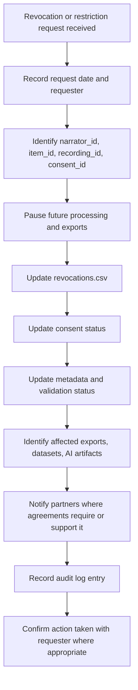

# QashqAI Voice Revocation Workflow

## Purpose

This workflow defines how QashqAI Voice should respond when a narrator, family representative, or authorized cultural authority revokes or narrows consent.

Revocation must be treated as a governance priority.

## Revocation Received Workflow

## Immediate Actions

- [ ] Acknowledge request.
- [ ] Identify affected item IDs.
- [ ] Identify affected recording IDs.
- [ ] Identify affected consent IDs.
- [ ] Pause future processing.
- [ ] Pause future export.
- [ ] Pause dataset inclusion.
- [ ] Pause AI processing.

## Records To Update

- [ ] `consent_ledger.csv`
- [ ] `revocations.csv`
- [ ] relevant `metadata.json`
- [ ] relevant `validation.json`
- [ ] `audit_log.csv`
- [ ] `export_log.csv`, if previous exports are affected

## Revocation Scope

Record whether revocation applies to:

- all future use;
- public access only;
- institutional sharing only;
- research use only;
- AI processing only;
- AI training only;
- embeddings or search indexes;
- synthetic voice;
- specific files or excerpts;
- identity display or attribution.

## External Material

If material was previously exported:

- identify recipients;
- review partnership or export terms;
- send takedown or restriction request where applicable;
- record partner response;
- record any known limits to removal.

Do not promise complete removal from external systems unless it is technically and contractually possible.

## Emergency Removal

Use emergency removal when continued access may create immediate privacy, dignity, cultural, or safety risk.

Emergency removal may happen before full review, but documentation should be completed afterward.

## Human Review Required

Human review is required to interpret the scope of revocation, communicate respectfully with the requester, assess affected materials, and decide whether emergency removal is needed.

