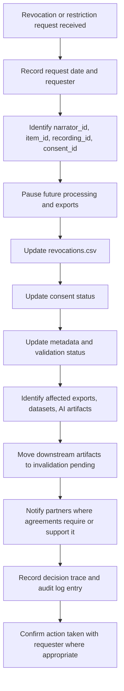

# QashqAI Voice Revocation Workflow

## Purpose

This workflow defines how QashqAI Voice should respond when a narrator, family representative, or authorized cultural authority revokes or narrows consent.

Revocation must be treated as a governance priority.

## Revocation Received Workflow

## Immediate Actions

- [ ] Acknowledge request.
- [ ] Identify affected item IDs.
- [ ] Identify affected recording IDs.
- [ ] Identify affected consent IDs.
- [ ] Pause future processing.
- [ ] Pause future export.
- [ ] Pause dataset inclusion.
- [ ] Pause AI processing.
- [ ] Move affected downstream artifacts to `downstream_invalidation_pending`.
- [ ] Generate decision trace and audit row for the revocation hold.

## Records To Update

- [ ] `consent_ledger.csv`
- [ ] `revocations.csv`
- [ ] relevant `metadata.json`
- [ ] relevant `validation.json`
- [ ] `audit_log.csv`
- [ ] `export_log.csv`, if previous exports are affected
- [ ] decision trace for revocation and downstream invalidation

## Revocation Scope

Record whether revocation applies to:

- all future use;
- public access only;
- institutional sharing only;
- research use only;
- AI processing only;
- AI training only;
- embeddings or search indexes;
- synthetic voice;
- specific files or excerpts;
- identity display or attribution.

## Precedence

Revocation or narrowed consent takes priority over prior approvals for future use. A prior export, research approval, validation status, AI permission field, or institutional request must not be used to continue an action that the revocation blocks.

Permitted post-revocation overrides are limited to:

- emergency restriction that further reduces access;
- clerical correction that does not expand use;
- documented scope clarification after human review.

Any scope clarification must be recorded in the revocation record, validation or metadata record where relevant, decision trace, and audit log.

## Downstream Invalidation

Affected downstream artifacts include transcripts, translations, summaries, embeddings, datasets, export packages, partner copies, public releases, synthetic voice artifacts, and training or evaluation commitments.

For each affected artifact:

- record the current lifecycle state;
- record whether the artifact is local, exported, public, partner-held, dataset-linked, or training-committed;
- apply `downstream_invalidation_pending` while review or partner action is unresolved;
- apply `invalidated` when future use has been blocked or the artifact has been removed from governed workflows;
- record limits where deletion, public recall, partner deletion, or model untraining cannot be verified;
- generate a decision trace and audit row.

## External Material

If material was previously exported:

- identify recipients;
- review partnership or export terms;
- send takedown or restriction request where applicable;
- record partner response;
- record any known limits to removal.

Do not promise complete removal from external systems unless it is technically and contractually possible.

## Emergency Removal

Use emergency removal when continued access may create immediate privacy, dignity, cultural, or safety risk.

Emergency removal may happen before full review, but documentation should be completed afterward.

## Human Review Required

Human review is required to interpret the scope of revocation, communicate respectfully with the requester, assess affected materials, and decide whether emergency removal is needed.
